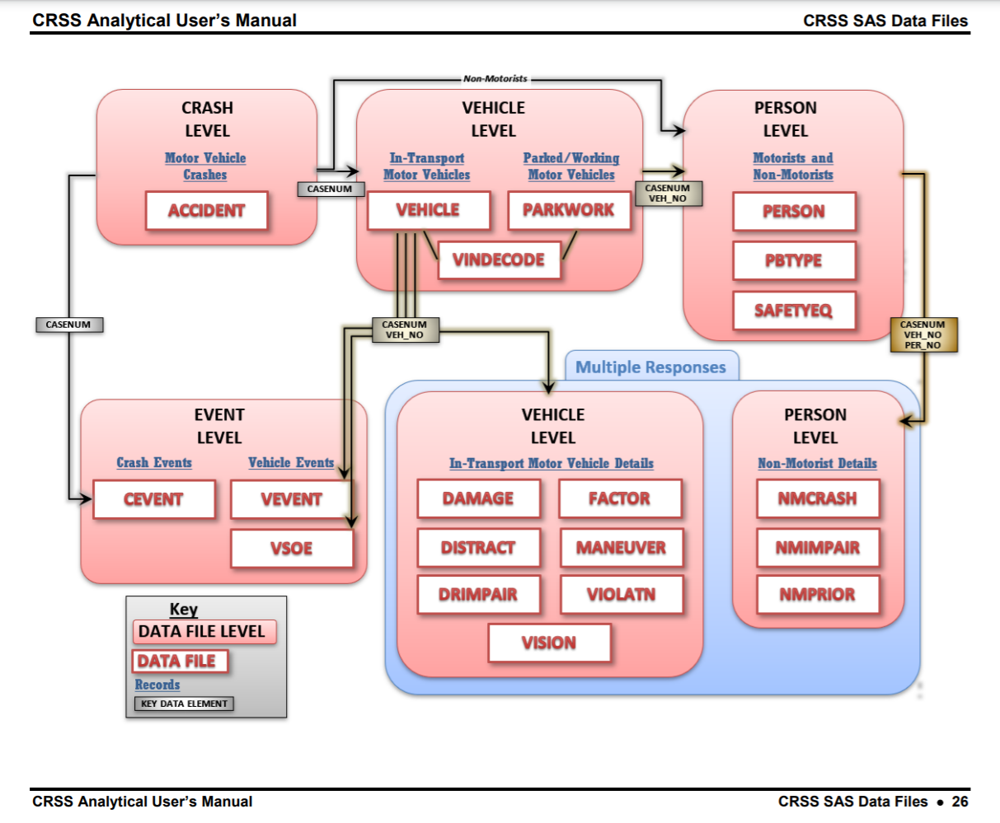

## **Introduction**

For this project, I will be conducting an exploratory data analysis (EDA) using the datasets provided by the National Highway Traffic Safety Administration (NHTSA). These datasets, organized under two systems, are all oriented around capturing the available information on motor vehicle traffic accidents in the United States during a given year. Both systems were most recently updated in 2018, and stretch back as far as the early 1970s. However, for the purpose of this EDA, I will be focusing on the data system known as the Crash Report Sampling System (CRSS). Moreover, I will be focusing solely on the data collected during the year 2018, as the NHTSA made a large number of changes to the variables monitored under the CRSS beginning with that year's data.

<br><br>

### The CRSS Data Environment

The NHTSA maintains the CRSS data system in order to equip researchers with the information they need in order to "estimate the overall crash picture", "identify highway safety problem[s]", and "form the basis for cost and benefit analyses of highway safety initiatives and regulations" (NHTSA, 2020). The CRSS itself consists of "police-reported crashes" involving "all types of motor vehicles [and] pedestrians" (NHTSA, 2020).

However, it is worth noting that the CRSS is not structured as a singular dataset. Instead, it is described by the NHTSA as its own "data environment", with multiple different "data items" stored within (NHTSA, 2020). For the purpose of this EDA, I will be referring to these individual datasets as "data items" as to avoid any confusion. Below is a visual depicting the structure of the CRSS data and the relationships between the different "data items:"



As shown above, there are several different ways in which accidents are understood and categorized under this system. Ultimately, each different data item represents a different perspective of the information captured within the CRSS. Although a more thorough data cleaning process is required in order to draw from multiple data items at once, each perspective offers its own unique insights. As such, this EDA walks through four of the most important data items, which have been cleaned and renamed as the `accidents`, `people` and `vehicles` data items (there is also the `distractions` data item, which is joined with the `people` data item when it is relevant to the EDA).

<br><br>

### Collection and Cleaning Summary

In order to collect the CRSS data items, they were downloaded as .csv files directly from the NHTSA's website at the following link:

[Link to the NHTSA website, where the CRSS data can be accessed: https://www.nhtsa.gov/content/nhtsa-ftp/221](https://www.nhtsa.gov/content/nhtsa-ftp/221)

It is worth noting that the vast majority of the variables within all four data items are factors. Unfortunately, their values were originally stored as numbers, with their true value recorded in the CRSS codebook. This meant that an extensive cleaning process was required, and involved manually adjusting the values of every possible factor value.

Moreover, it is worth noting that missingness in these data items manifests itself in an unusual way. As the CRSS draws upon police reporting, there are no instances at all whatsoever of incomplete or missing data values within the CRSS. Instead, there are cases where an entry may represent the fact that the police reported a specific characteristic of an accident was unknown to them. As such, I have attempted to consolidate these values in a way which combines all of the possible variations for responses such as "Unknown", "Not reported", or "Missing from Report".

Ultimately, the data cleaning and processing steps of this EDA resulted in four different tidy datasets: `accidents_cleaned`, `distractions_cleaned`, `people_cleaned`, and `vehicles_cleaned`. All four are also saved within the `processed` folder in the `data` folder (as .rds) files corresponding to this EDA. We will move through each item individually, and will explore the insights they have to offer.

<br><br>

### Load Packages
Below, for the sake of transparency and reproducibility, I have listed out the packages I used throughout this EDA: 
```{r load-packages, message=FALSE, warning=FALSE}
# Loading package(s)
library(tidyverse)
library(lubridate)
library(janitor)
# Code Included Deliberately
```

```{r load-data, load-packages, message=FALSE, echo=FALSE}
## Loading the .rds files from the `processed` directory
accidents_cleaned <- read_rds("data/processed/accidents_cleaned.rds")

distractions_cleaned <- read_rds("data/processed/distractions_cleaned.rds")

people_cleaned <- read_rds("data/processed/people_cleaned.rds")

vehicles_cleaned <- read_rds("data/processed/vehicles_cleaned.rds")
```

<br><br>

## **The `Accidents`-Oriented Perspective**

### Starting with `Geographic Region`

The first data item this EDA will cover is the `accidents_cleaned` data item, which represents the `accidents`-focused perspective of the CRSS data. In this instance, each row represents a single accident.

An excellent starting point for our investigation of this data item would be to look generally at how the accidents are spread over the four geographic regions of the United States:

```{r accidents-1, message=FALSE, warning=FALSE, echo=FALSE}
# Looking at `region`
ggplot(accidents_cleaned) +
  geom_bar(aes(x = region, fill = region)) +
  theme(legend.position = "none") +
  labs(x = "Geographic Region", y = "Count")
```

In the visualization above, we can see how the accidents are spread all throughout the United States. It is noteworthy how the accidents are evenly spread between the `Midwest`, `Northeast`, and `West`, but the vast majority took place in the `South`. Moving on to the next variables of interest, `month` and `wday` (weekday), we can continue to look at some of these high-level patterns in the `accidents_cleaned` data item.
 
<br><br>

### Looking at `Month` and `Weekday`

Below, we can observe a series of barplots faceted by `month`, which display the distribution of accidents by `wday` (weekday).

```{r accidents-2, message=FALSE, warning=FALSE, echo=FALSE}
# Faceted barplot with `wday` and `month` information
ggplot(accidents_cleaned) +
  geom_bar(aes(x = wday)) +
  facet_wrap(~month) +
  theme(axis.text.x = element_text(angle = 45, hjust = 1)) +
  labs(x = "Weekday", y = "Count")
```

Although generally, there are fewer accidents on the weekends than during the work week, there appears to be a substantial amount of variation across the different months. In some months, such as `Sep`tember, there is a pattern where the accident `count` steadily increases throughout the week. In contrast, there are other months such as `Nov`ember where there is a dramatic peak on a specific weekday (in this case, on `Fri`day). This could suggest a greater pattern which shifts over the course of the year.

Keeping such large-scale patterns in mind, let us pivot over towards evaluating the impact of `weather` and `light_con`ditions on the accidents recorded in the `accidents_cleaned` data item.

<br><br>

### Looking at `Weather` and `Light Conditions` (`light_con`)

#### `weather` and `month`

Intuitively, it is reasonable to assume that the `weather` and `light_con`ditions and would have a substantial impact on the quantity of crashes. Below, a visualization has been built displaying the count of recorded crashes in the `accidents_cleaned` data item. The data is displayed over the course of the different months, with the color aesthetic assigned to the reported `weather` conditions.

```{r accidents-3, message=FALSE, warning=FALSE, echo=FALSE}
accidents_cleaned %>% 
  filter(weather == "Clear" | weather == "Cloudy" | weather == "Rain"
         | weather == "Not Reported/Reported as Unknown" | weather == "Snow" |
           weather == "Fog, Smog, Smoke") %>% 
  # Keeping six most frequent conditions to avoid overwhelming legend
  ggplot() +
  geom_bar(aes(x = month, fill = weather)) +
  labs(x = "Month", y = "Count", fill = "Reported Weather Conditions")
```

Surprisingly, the vast majority of the crashes which occurred in 2018 took place under `"Clear"` `weather` conditions. Other than that we can observe a slight increase in the number of `"Snow"`-related accidents in the winter, and pretty consistent levels among other `weather` categories.

<br><br>

#### `light_con` and `time`

As previously mentioned, it would be reasonable to assume that `light_con`ditions would play an important role when it comes to whether or not an accident occurs. Moreover, it would be interesting to also take the `time` of day into consideration, given the close relationship between the two variables. Below, we can see a histogram where each bin corresponds to a 30-minute period in the day, and the color aesthetic is assigned to the reported `light_con`dition.

```{r accidents-4, message=FALSE, warning=FALSE, echo=FALSE}
ggplot(accidents_cleaned) +
  geom_histogram(aes(x = time, fill = light_con), bins = 48) +
  annotate("rect", xmin = 21600, xmax = 36000, ymin = 0, ymax = Inf,
           alpha = .2) +
  annotate("rect", xmin = 54000, xmax = 68400, ymin = 0, ymax = Inf, 
           alpha = .2) +
  labs(x = "Time of Accident", y = "Count", fill = "Reported Light Condition")
```

Interestingly enough, the vast majority of accidents took place under the `Daylight` lighting category. However, during the extreme early and late hours of the day, there were many accidents which also occurred under the `Dark - Lighted` lighting category. This makes sense, given the abundance of light available along most popular driving routes.

Turing our attention towards the `time` of accident, we can observe two sharp peaks emerging towards the center of each shaded region. In the visualization above, the two shaded regions also correspond with "rush hour", which is typically associated with the periods of time between 6:00 - 10:00 and 15:00 - 19:00. As such, it makes sense that the two peaks would emerge during these two periods. Generally though, the highest volume of accidents corresponds with the later half of the day (after noon).

Setting these conditions aside, we can also delve into the `accidents_cleaned` data item to learn more about the manner in which collisions occurred (`manner_coll`), and the maximum injury severity (`crash_max_sev`) associated with each `accident`.

<br><br>

### Looking at `manner_coll` and `crash_max_sev`

Below is a barplot displaying the count for `accidents` which correspond to each injury severity.

```{r accidents-5, message=FALSE, warning=FALSE, echo=FALSE}
# crash_max_sev barplot
accidents_cleaned %>% 
  group_by(crash_max_sev) %>% 
  summarize(n = n()) %>% 
  mutate(prop = n/sum(n)) %>% 
  arrange(desc(n)) %>% 
  mutate(crash_max_sev = fct_reorder(crash_max_sev, n, .desc = TRUE)) %>% 
  ggplot() + 
  geom_col(aes(x = crash_max_sev, y = n)) +
  theme(axis.text.x = element_text(angle = 45, hjust = 1)) +
  labs(x = "Maximum Injury Severity in Crash", y = "Count")
```

I was surprised to see that the vast majority of `accidents` seem to have had `"No Apparent Injury"` associated with them. Let us see if this pattern is consistent across the different recorded manners of collision (`manner_coll`):

```{r accidents-6, message=FALSE, warning=FALSE, echo=FALSE}
# crash_max_sev barplot
accidents_cleaned %>% 
  count(manner_coll, crash_max_sev) %>% 
  mutate(manner_coll = fct_infreq(manner_coll)) %>% 
  ggplot(aes(x = crash_max_sev, y = manner_coll)) +
  geom_tile(aes(fill = n)) +
  theme(axis.text.x = element_text(angle = 45, hjust = 1)) +
  labs(x = "Maximum Injury Severity in Crash", y = "Manner of Collision",
       fill = "Count")
```

Although this visualization incorporates far more information, it leads us to a similar conclusion as our previous one. The squares with the highest `Count` correspond to `"Front-to-Rear"`, `"Not Collision with Motor Vehicle"`, and `"Angle"` accidents with `"No Apparent Injury"`.

However, the CRSS data universe offers us various different perspectives to choose when evaluating this data. When examining the severity of injuries, it could be advantageous to shift our point of view to view `people` as the basic unit of observation instead of `accidents`.

<br><br>

## **The `People`-Oriented Perspective**

The `people_cleaned` data item offers us an alternative view of the CRSS data universe. Looking at each individual `person` and their demographic information, we can pull some new insights from the CRSS data. Moreover, we can pull more granular, specific data about each crash using this perspective.

### Individual Demographic Information and `injury_sev`

#### `Age` and `Individual Injury Severity` (`injury_sev`)

Firstly, let us try to learn more about the different injury severity (`injury_sev`) categories. Let us start off again at the highest level possible, by just generally looking through the distribution of age by injury severity (`injury_sev`).

```{r people-1, message=FALSE, warning=FALSE, echo=FALSE}
people_cleaned %>%
  mutate(injury_sev = fct_infreq(injury_sev)) %>%
  ggplot() +
  geom_boxplot(aes(x = injury_sev, y = age)) +
  geom_hline(yintercept = 35, size = 2, color = "grey") +
  theme(axis.text.x = element_text(angle = 45, hjust = 1)) +
  labs(x = "Individual Injury Severity", y = "Age (Median = 35 years)")
```

For the most part though, there is not much out of the ordinary taking place here. However, it is noteworthy that the `"Fatal"`, `"Injured, Severity Unknown"`, and `"Died Prior to Crash"` injury severity categories tended to include individuals older than the median `person`. The `"Died Prior to Crash"` category features the most extreme group of individuals, who are all quite far above the median age.

Moving on to the next demographic category, let us explore the distribution of injuries by reported `sex`.

<br><br>

#### Reported `Sex` and `Individual Injury Severity` (`injury_sev`)

```{r people-2, message=FALSE, warning=FALSE, echo=FALSE}
people_cleaned %>% 
  mutate(injury_sev = fct_infreq(injury_sev)) %>% 
  filter(sex != "Not Reported/Unknown") %>% 
  count(sex, injury_sev) %>% 
  group_by(sex) %>% 
  mutate(prop = n/sum(n)) %>% 
  ggplot() +
  geom_col(aes(x = injury_sev, y = prop)) +
  facet_wrap(~sex) +
  theme(axis.text.x = element_text(angle = 45, hjust = 1)) +
  labs(x = "Individual Injury Severity", y = "Proportion of Total Injuries")
```

It is surprising, but admittedly logical, that there does not appear to be a substantial visual difference between these two distributions. As such, let us move on to a more meaningful difference in relation to `accidents`: the role of the individual during the accident.

<br><br>

### Looking at the role `Person Type` plays with `Individual Injury Severity` (`injury_sev`)

Below is a series of faceted visualizations depicting the distribution of injury types for each of the most important `person_type`s in the `people_cleaned` data item.

```{r people-3, message=FALSE, warning=FALSE, echo=FALSE}
people_cleaned %>% 
  mutate(injury_sev = fct_infreq(injury_sev)) %>% 
  filter(person_type != "Persons on Personal Conveyances",
         person_type != "Unknown in a Motor Vehicle in Transport",
         person_type != "Other Cyclist ",
         person_type != "Persons in or on Buildings") %>%
  count(person_type, injury_sev) %>% 
  group_by(person_type) %>% 
  mutate(prop = n/sum(n)) %>% 
  ggplot() +
  geom_col(aes(x = injury_sev, y = prop)) +
  facet_wrap(~person_type) +
  theme(axis.text.x = element_text(angle = 45, hjust = 1)) +
  labs(x = "Injury Severity", y = "Proportion of Total Injuries")
```

Unlike some of the other faceted plots, this one presents us with a stark visual difference between the distributions of injuries. When it comes to the `person_type`s which were inside of a vehicle ("Driver of a Motor Vehicle in Transport", "Occupant of a Motor Vehicle Not in Transport", and "Passenger of a Motor Vehicle in Transport"), the distribution of injuries is more in-line with what we have previously observed. In these instances, the vast majority of individuals walk away from the accident without any reported injuries, or a infrequently a minor injury. However, when we look at the `person_type`s which were outside of a vehicle (Bicyclist", "Other Cyclist", "Pedestrian"), the distribution of injuries is far more severe. These individuals had a larger proportion of possible minor and serious injuries, and sometimes fatalities, than their counterparts which were in vehicles.

<br><br>

### Joining the `distractions_cleaned` data with the `people_cleaned` data

Moving towards other possible angles to consider, there is the `distractions_cleaned` data item. This was pulled specifically from the CRSS data universe in order to perform the appropriate joins in order to include data on driver distractions into the `people_cleaned` data item.

Below is a visualization which incorporates this new information from the `distractions_cleaned` data item, along with information on individual injury severity.

```{r people-4, message=FALSE, warning=FALSE, echo=FALSE}
# Let's join in the data from `distractions`
people_joined <- people_cleaned %>% 
  inner_join(distractions_cleaned, by = c("case_num", "vehicle_num"))

# Let's keep the 9 most common ones and build a visualization
people_joined %>% 
  filter(driver_distraction == "Not Distracted"|
         driver_distraction == "Not Reported/Unknown"|
         driver_distraction == "Inattention, Details Unknown"|
         driver_distraction == "Careless/Inattentive"|
         driver_distraction == "Distracted By Outside Person, Object Or Event"|
         driver_distraction == "Distraction, Details Unknown"|
         driver_distraction == "While Using Or Reaching For Device/Object Brought into Vehicle"|
         driver_distraction == "By Other Occupants"|
         driver_distraction == "Other Distraction") %>% 
  mutate(injury_sev = fct_infreq(injury_sev)) %>% 
  count(driver_distraction, injury_sev) %>% 
  group_by(driver_distraction) %>% 
  mutate(prop = n/sum(n)) %>% 
  ggplot() +
  geom_col(aes(x = injury_sev, y = prop)) +
  facet_wrap(~driver_distraction) +
  theme(axis.text.x = element_text(angle = 45, hjust = 1)) +
  labs(x = "Type of Driver Distraction", y = "Proportion of Total Injuries")
```

Surprisingly, the distributions are extremely consistent across the nine most common distraction categories. However, it is worth noting the high degree of `Not Reported/Unknown` distraction values. This makes sense considering the fact that it may have been difficult for police officers to determine this after an accident has occured.

Nevertheless, out of curiosity, let's take a peek at the age range for each of the nine most common distractions.

```{r people-5, message=FALSE, warning=FALSE, echo=FALSE}
people_joined %>% 
  filter(driver_distraction == "Not Distracted"|
           driver_distraction == "Not Reported/Unknown"|
           driver_distraction == "Inattention, Details Unknown"|
           driver_distraction == "Careless/Inattentive"|
           driver_distraction == "Distracted By Outside Person, Object Or Event"|
           driver_distraction == "Distraction, Details Unknown"|
           driver_distraction == "While Using Or Reaching For Device/Object Brought into Vehicle"|
           driver_distraction == "By Other Occupants"|
           driver_distraction == "Other Distraction") %>%
  mutate(driver_distraction = fct_reorder(driver_distraction, age)) %>% 
  group_by(driver_distraction) %>% 
  ggplot() +
  geom_boxplot(aes(x = driver_distraction, y = age)) +
  theme(axis.text.x = element_text(angle = 45, hjust = 1)) +
  geom_hline(yintercept = 35, size = 2, color = "grey") +
  labs(x = "Type of Driver Distraction", y = "Age (Median = 35 years)")
```

It is surprising to see that for the `"By Other Occupants"`, `"While Using Or Reaching For Device/Object Brought into Vehicle"`, and `"Distracted By Outside Person, Object Or Event"` categories the distributions for age appears to be lower than the overall median age for the `people` in the CRSS data universe.

With the `people_cleaned` data item exhausted for the time being, let us explore the last available perspective of the CRSS data universe: the `vehicles`-oriented point-of-view.

<br><br>

## **The `Vehicles`-Oriented Perspective**

The `vehicles_cleaned` data item offers us an alternative view of the CRSS data universe. Looking at each individual `vehicle` and additional vehicle-specific details, we can pull some new insights from the CRSS data. Moreover, we can pull more granular, specific data about each crash using this perspective.

### The distribution of reported `speed`

In the visualization below, we can observe the distribution of reported `speed`s.

```{r vehicles-1, message=FALSE, warning=FALSE, echo=FALSE}
vehicles_cleaned %>% 
  mutate(speed = fct_collapse(speed,
                              `Not Reported/Unknown` = "Not Reported/Unknown",
                              `1-10 mph` = "1-10 mph",
                              `11-20 mph` = "11-20 mph",
                              `21-30 mph` = "21-30 mph",
                              `31-40 mph` = "31-40 mph",
                              `41-50 mph` = "41-50 mph",
                              `51-60 mph` = "51-60 mph",
                              `61-70 mph` = "61-70 mph",
                              `71-80 mph` = "71-80 mph",
                              `81-90 mph` = "81-90 mph",
                              `91-100 mph` = "91-100 mph",
                              `Greater than 100 mph` = c("101-110 mph",
                                                         "111-120 mph",
                                                         "121-130 mph",
                                                         "131-140 mph",
                                                         "Greater than 151 mph"))) %>% 
  mutate(speed = fct_relevel(speed, "91-100 mph", after = 11)) %>% 
  mutate(speed = fct_relevel(speed, "Greater than 100 mph", after = 12)) %>% 
  mutate(speed = fct_relevel(speed, "Not Reported/Unknown", after = 0)) %>% 
  ggplot() +
  geom_bar(aes(x = speed)) +
  theme(axis.text.x = element_text(angle = 45, hjust = 1)) +
  labs(x = "Reported Speed Prior to Crash", y = "Count")
  # Alarmingly high proportion of unknown values here
```

In this instance, there is an alarmingly high proportion of missing values. This could be due to the nature of the reporting system, and the difficulty associated with gathering the vehicle's travelling speed in advance. Moreover, it is also surprising to see that a large number of vehicles had a reported speed of `"0 mph"`, suggesting that they were standing still. Prior to seeing this result, I had expected to see a larger quantity of high-`speed` accidents. As such, this was a surprising result.

<br><br>

### Comparing different `vehicle_make`s

One of the most significant advantages of skimming through the `vehicles_cleaned` data item is that it offers information on the `vehicle_make` of each vehicle in the CRSS data environment. In the following portion of this EDA, we will visualize the relationship between `vehicle_make` and variables such as `dmg_extent` and `vehicle_max_sev`.

#### `vehicle_make` and `dmg_extent`

After selecting the top 20 vehicle makes, we can build a visualization depicting the distribution of vehicle damage categories (`dmg_extent`).

```{r vehicles-2, message=FALSE, warning=FALSE, echo=FALSE}
# Creating the lists for the top 20 and top 9 makes for joining purposes
top_20_makes <- vehicles_cleaned %>% 
  group_by(vehicle_make) %>% 
  summarize(n = n()) %>% 
  mutate(prop = n/sum(n)) %>% 
  arrange(desc(n)) %>% 
  slice_head(n = 20) %>% 
  select(vehicle_make)

top_9_makes <- vehicles_cleaned %>% 
  group_by(vehicle_make) %>% 
  summarize(n = n()) %>% 
  mutate(prop = n/sum(n)) %>% 
  arrange(desc(n)) %>% 
  slice_head(n = 9) %>% 
  select(vehicle_make)

# geom_tile() for top 20 makes
vehicles_cleaned %>% 
  inner_join(top_20_makes, by = "vehicle_make") %>% 
  mutate(dmg_extent = fct_relevel(dmg_extent, "Disabling Damage", after = 2)) %>%
  mutate(dmg_extent = fct_relevel(dmg_extent, "Functional Damage", after = 1)) %>% 
  mutate(dmg_extent = fct_relevel(dmg_extent, "No Damage", after = 0)) %>% 
  mutate(dmg_extent = fct_relevel(dmg_extent, "Not Reported/Unknown", after = 0)) %>% 
  count(vehicle_make, dmg_extent) %>% 
  group_by(vehicle_make) %>% 
  mutate(prop_for_make = n/sum(n)) %>% 
  ggplot(aes(x = dmg_extent, y = vehicle_make)) +
  geom_tile(aes(fill = prop_for_make)) +
  theme(axis.text.x = element_text(angle = 45, hjust = 1)) +
  labs(x = "Vehicle Damage Extent", y = "Vehicle Make", fill = "Proportion of Damage Categories per Make")
```

As we can observe in the plot above, there are consistently more accidents where vehicles sustain either `"Minor"`, `"Functional"`, or `"Disabling Damage"`. Of these categories, `"Disabling Damage"` tends to be the most common, followed by `"Minor"` and then `"Functional Damage"`. The pattern can be made more apparent by selecting the top 9 most common `vehicle_make`s instead.

```{r vehicles-3, message=FALSE, warning=FALSE, echo=FALSE}
# geom_col for top 9 makes, faceted
vehicles_cleaned %>% 
  inner_join(top_9_makes, by = "vehicle_make") %>% 
  mutate(dmg_extent = fct_relevel(dmg_extent, "Disabling Damage", after = 2)) %>%
  mutate(dmg_extent = fct_relevel(dmg_extent, "Functional Damage", after = 1)) %>% 
  mutate(dmg_extent = fct_relevel(dmg_extent, "No Damage", after = 0)) %>% 
  mutate(dmg_extent = fct_relevel(dmg_extent, "Not Reported/Unknown", after = 0)) %>% 
  count(vehicle_make, dmg_extent) %>% 
  group_by(vehicle_make) %>% 
  mutate(prop_for_make = n/sum(n)) %>% 
  ggplot(aes(x = dmg_extent, y = prop_for_make)) +
  geom_col() +
  facet_wrap(~vehicle_make) +
  theme(axis.text.x = element_text(angle = 45, hjust = 1)) +
  labs(x = "Vehicle Damage Extent", y = "Proportion of Crashes for Make")
```

In this instance, the consistency of the pattern across all `vehicle_makes` has been made more apparent, which was surprising to say the least. I had anticipated a far more substantial difference, especially given the difference in quality between some of these `vehicle_make`s. Perhaps looking instead at the most severe injury in the vehicle for a given crash can find a pattern where there is a significant difference between `vehicle_make`s.

<br><br>

#### `vehicle_make` and `vehicle_max_sev`

In the visualization below, we can see the distribution of injury types scattered among the top 20 most common `vehicle_make`s.

```{r vehicles-4, message=FALSE, warning=FALSE, echo=FALSE}
# geom_tile() with top 20 makes
vehicles_cleaned %>% 
  inner_join(top_20_makes, by = "vehicle_make") %>% 
  mutate(vehicle_max_sev = fct_infreq(vehicle_max_sev)) %>% 
  count(vehicle_make, vehicle_max_sev) %>% 
  group_by(vehicle_make) %>% 
  mutate(prop_for_make = n/sum(n)) %>% 
  ggplot(aes(x = vehicle_max_sev, y = vehicle_make)) +
  geom_tile(aes(fill = prop_for_make)) +
  theme(axis.text.x = element_text(angle = 45, hjust = 1)) +
  labs(x = "Maximum Injury Severity Per Vehicle", y = "Vehicle Make", fill = "Proportion of Injuries per Make")
```

As was the case previously, let us focus on the top 9 most common `vehicle_make`s instead.

```{r vehicles-5, message=FALSE, warning=FALSE, echo=FALSE}
# faceted barplot with top 9 makes
vehicles_cleaned %>% 
  inner_join(top_9_makes, by = "vehicle_make") %>% 
  mutate(vehicle_max_sev = fct_infreq(vehicle_max_sev)) %>% 
  count(vehicle_make, vehicle_max_sev) %>% 
  group_by(vehicle_make) %>% 
  mutate(prop_for_make = n/sum(n)) %>% 
  ggplot(aes(x = vehicle_max_sev, y = prop_for_make)) +
  geom_col() +
  facet_wrap(~vehicle_make) +
  theme(axis.text.x = element_text(angle = 45, hjust = 1)) +
  labs(x = "Maximum Injury Severity Per Vehicle", y = "Proportion of Injuries per Make")
```

Once again, it is surprising to see a consistent pattern across all `vehicle_make`s. I had initially suspected that perhaps there would be a number of `vehicle_make`s that offer more protection or might happen to be safer, but it is clear that this is not the case. There is very little difference between the different `vehicle_make`s from what we have seen in this data item thus far.

<br><br>


## **Conclusion**

### Project Relevance

All in all, this data represents a part of a broader shift towards the greater utilization and awareness of data when it comes to transportation and insurance in general. Improved access and familiarity with datasets such as the data systems produced by the NHTSA has enabled companies to shift away from traditional underwriting practices, which involve controversial variables, to data that is directly related to an individual’s driving ability and history. Moreover, these datasets are relevant given the advent of autonomous vehicles on the open road. Ultimately, I am interested in becoming more familiar with the data available on this subject, given that it is central to many structural changes that are occurring across multiple different industries.

<br><br>

### Next Steps

Despite my best attempts to thoroughly explore the different aspects of the CRSS data environment, there are still insights left for others to unearth. Exploring the data items I left untouched, related to parked vehicles and other subjects, could also be worth exploring. Lastly, it would be worthwhile revisiting this EDA with the purpose of restructuring and optimizing the data cleaning process.

<br><br>